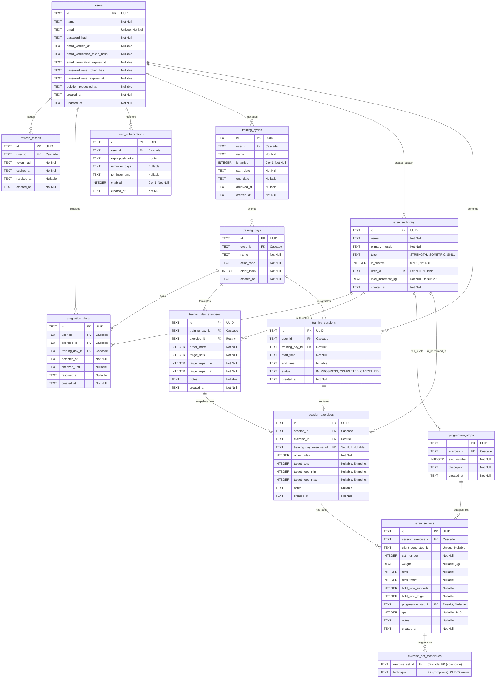

# 02_SCHEMA_SQLITE.md - Modelagem e Esquema Relacional (SQLite)

Este documento define de forma absoluta o esquema do banco de dados relacional **SQLite** do projeto **IronTrack**. Ele especifica o diagrama Entidade-Relacionamento (ER), as tabelas, tipos de dados, restrições de chaves, índices de performance e fornece scripts de população inicial (seed) detalhados que exemplificam o suporte à musculação clássica e à calistenia avançada.

---

## 1. Diagrama Entidade-Relacionamento (ER)

O diagrama abaixo, desenvolvido em sintaxe `mermaid`, ilustra as entidades do sistema, seus atributos primários e os graus de relacionamento.



---

## 2. DDL - Scripts de Criação de Tabelas (SQLite)

Os scripts SQL abaixo foram escritos de acordo com as particularidades do **SQLite**, mapeando booleanos como inteiros (`0` ou `1`) e datas/timestamps como strings `TEXT` padronizadas em ISO8601 (`YYYY-MM-DD"T"HH:MM:SS.SSSZ`).

```sql
-- Ativação do suporte a chaves estrangeiras no SQLite (Executar por conexão)
PRAGMA foreign_keys = ON;

-- 1. TABELA: users
CREATE TABLE users (
    id TEXT PRIMARY KEY,
    name TEXT NOT NULL,
    email TEXT UNIQUE NOT NULL,
    password_hash TEXT NOT NULL,
    -- Verificação de e-mail e reset de senha: sempre hash, nunca o token em texto plano
    email_verified_at TEXT,
    email_verification_token_hash TEXT,
    email_verification_expires_at TEXT,
    password_reset_token_hash TEXT,
    password_reset_expires_at TEXT,
    -- deletion_requested_at (11_POLITICA_DE_PRIVACIDADE_E_RETENCAO_DE_DADOS.md §D):
    -- NULL = conta ativa; preenchido = em período de carência de exclusão (30 dias)
    deletion_requested_at TEXT,
    created_at TEXT NOT NULL,
    updated_at TEXT NOT NULL
);

-- 1.1. TABELA: refresh_tokens
-- Mecanismo SQLite-only para refresh tokens (substitui uso de Redis).
CREATE TABLE refresh_tokens (
    id TEXT PRIMARY KEY,
    user_id TEXT NOT NULL,
    token_hash TEXT NOT NULL,
    expires_at TEXT NOT NULL,
    revoked_at TEXT,
    created_at TEXT NOT NULL,
    FOREIGN KEY (user_id) REFERENCES users(id) ON DELETE CASCADE
);
CREATE INDEX idx_refresh_tokens_user ON refresh_tokens (user_id);
CREATE INDEX idx_refresh_tokens_hash ON refresh_tokens (token_hash);

-- 2. TABELA: training_cycles
CREATE TABLE training_cycles (
    id TEXT PRIMARY KEY,
    user_id TEXT NOT NULL,
    name TEXT NOT NULL,
    is_active INTEGER NOT NULL DEFAULT 0 CHECK(is_active IN (0, 1)),
    start_date TEXT NOT NULL,
    end_date TEXT,
    -- archived_at: distingue arquivamento explícito (DELETE /cycles/{id})
    -- de um ciclo simplesmente não-ativo no momento (is_active = 0 sem archived_at setado)
    archived_at TEXT,
    created_at TEXT NOT NULL,
    FOREIGN KEY (user_id) REFERENCES users(id) ON DELETE CASCADE
);

-- Garante um único ciclo ativo por usuário — índice único parcial
CREATE UNIQUE INDEX idx_cycles_user_single_active
ON training_cycles (user_id) WHERE is_active = 1;

-- 3. TABELA: training_days
CREATE TABLE training_days (
    id TEXT PRIMARY KEY,
    cycle_id TEXT NOT NULL,
    name TEXT NOT NULL,
    color_code TEXT NOT NULL DEFAULT '#000000',
    order_index INTEGER NOT NULL,
    created_at TEXT NOT NULL,
    FOREIGN KEY (cycle_id) REFERENCES training_cycles(id) ON DELETE CASCADE,
    UNIQUE(cycle_id, order_index)
);

-- 3.1. TABELA: training_day_exercises (template do dia de treino)
-- Vincula um training_day aos exercícios que o compõem, com metas planejadas.
-- É o dado de entrada que falta para o motor de sobrecarga
-- progressiva (06_LOGICA_DE_PROGRESSAO.md) avaliar "atingiu o teto de repetições".
-- A faixa target_reps_min/target_reps_max existe porque o produto pede metas do
-- tipo "3x8-12" (faixa), enquanto exercise_sets.reps_target continua sendo um
-- único inteiro — o valor específico que o usuário deve buscar NAQUELA série
-- concreta dentro da faixa (definido pela lógica de progressão em 06, não pelo
-- template). O template define a faixa; a sessão/série concreta recebe uma
-- meta pontual dentro dela.
CREATE TABLE training_day_exercises (
    id TEXT PRIMARY KEY,
    training_day_id TEXT NOT NULL,
    exercise_id TEXT NOT NULL,
    order_index INTEGER NOT NULL CHECK(order_index >= 0),
    target_sets INTEGER NOT NULL CHECK(target_sets > 0),
    target_reps_min INTEGER NOT NULL CHECK(target_reps_min > 0),
    target_reps_max INTEGER NOT NULL CHECK(target_reps_max >= target_reps_min),
    notes TEXT,
    created_at TEXT NOT NULL,
    FOREIGN KEY (training_day_id) REFERENCES training_days(id) ON DELETE CASCADE,
    FOREIGN KEY (exercise_id) REFERENCES exercise_library(id) ON DELETE RESTRICT,
    UNIQUE(training_day_id, order_index)
);

-- 4. TABELA: exercise_library
CREATE TABLE exercise_library (
    id TEXT PRIMARY KEY,
    name TEXT NOT NULL,
    primary_muscle TEXT NOT NULL,
    type TEXT NOT NULL CHECK(type IN ('STRENGTH', 'ISOMETRIC', 'SKILL')),
    is_custom INTEGER NOT NULL DEFAULT 0 CHECK(is_custom IN (0, 1)),
    user_id TEXT,
    -- load_increment_kg: incremento de carga configurável por
    -- exercício (não uma tabela rígida "grupo muscular → incremento") — mais
    -- flexível, permite ajuste fino por movimento específico.
    load_increment_kg REAL NOT NULL DEFAULT 2.5,
    created_at TEXT NOT NULL,
    FOREIGN KEY (user_id) REFERENCES users(id) ON DELETE SET NULL
);

-- 5. TABELA: progression_steps
CREATE TABLE progression_steps (
    id TEXT PRIMARY KEY,
    exercise_id TEXT NOT NULL,
    step_number INTEGER NOT NULLCHECK(step_number > 0),
    description TEXT NOT NULL,
    created_at TEXT NOT NULL,
    FOREIGN KEY (exercise_id) REFERENCES exercise_library(id) ON DELETE CASCADE,
    UNIQUE(exercise_id, step_number)
);

-- 6. TABELA: training_sessions
CREATE TABLE training_sessions (
    id TEXT PRIMARY KEY,
    user_id TEXT NOT NULL,
    training_day_id TEXT NOT NULL,
    start_time TEXT NOT NULL,
    end_time TEXT,
    status TEXT NOT NULL DEFAULT 'IN_PROGRESS' CHECK(status IN ('IN_PROGRESS', 'COMPLETED', 'CANCELLED')),
    created_at TEXT NOT NULL,
    FOREIGN KEY (user_id) REFERENCES users(id) ON DELETE CASCADE,
    FOREIGN KEY (training_day_id) REFERENCES training_days(id) ON DELETE RESTRICT
);

-- 7. TABELA: session_exercises
CREATE TABLE session_exercises (
    id TEXT PRIMARY KEY,
    session_id TEXT NOT NULL,
    exercise_id TEXT NOT NULL,
    -- training_day_exercise_id: rastreabilidade de origem do template (06_LOGICA_DE_PROGRESSAO.md §1).
    -- Nullable e ON DELETE SET NULL: se o item do template for depois editado/removido do dia de
    -- treino, esta linha vira NULL sem afetar o histórico já copiado (session_exercises é imutável).
    training_day_exercise_id TEXT,
    order_index INTEGER NOT NULL CHECK(order_index >= 0),
    -- target_sets / target_reps_min / target_reps_max: SNAPSHOT CONGELADO da meta de
    -- training_day_exercises no exato instante em que POST /sessions/start roda — nunca
    -- relidos de training_day_exercises depois desse ponto. Garante que editar o template
    -- de um dia não altera retroativamente sessões já iniciadas/concluídas. Nullable para
    -- não quebrar sessões futuras sem template associado (caso hipotético fora do fluxo atual).
    target_sets INTEGER,
    target_reps_min INTEGER,
    target_reps_max INTEGER,
    notes TEXT,
    created_at TEXT NOT NULL,
    FOREIGN KEY (session_id) REFERENCES training_sessions(id) ON DELETE CASCADE,
    FOREIGN KEY (exercise_id) REFERENCES exercise_library(id) ON DELETE RESTRICT,
    FOREIGN KEY (training_day_exercise_id) REFERENCES training_day_exercises(id) ON DELETE SET NULL,
    UNIQUE(session_id, order_index)
);

-- 8. TABELA: exercise_sets
CREATE TABLE exercise_sets (
    id TEXT PRIMARY KEY,
    session_exercise_id TEXT NOT NULL,
    -- client_generated_id: UUID gerado no cliente, globalmente único.
    -- É o mecanismo que permite ao backend tratar reenvios da fila de sincronização
    -- offline (04_FRONTEND_UI_COMPONENTES.md §E.2) como idempotentes — um segundo
    -- INSERT com o mesmo client_generated_id falha a constraint UNIQUE abaixo, e o
    -- serviço deve tratar isso como "já persistido, retornar o registro existente",
    -- nunca como erro genérico.
    client_generated_id TEXT,
    set_number INTEGER NOT NULL CHECK(set_number > 0),
    
    -- Campos flexíveis e anuláveis
    weight REAL,                       -- Musculação Tradicional: carga utilizada
    reps INTEGER,                      -- Musculação / Habilidade: repetições executadas
    reps_target INTEGER,               -- Musculação / Habilidade: meta de repetições
    hold_time_seconds INTEGER,         -- Calistenia Isométrica: tempo sustentado
    hold_time_target INTEGER,          -- Calistenia Isométrica: tempo meta
    progression_step_id TEXT,          -- Calistenia Isométrica / Habilidade: nível atual
    
    -- Campos comuns
    rpe INTEGER CHECK(rpe IS NULL OR (rpe >= 1 AND rpe <= 10)),
    notes TEXT,
    created_at TEXT NOT NULL,
    
    FOREIGN KEY (session_exercise_id) REFERENCES session_exercises(id) ON DELETE CASCADE,
    FOREIGN KEY (progression_step_id) REFERENCES progression_steps(id) ON DELETE RESTRICT,
    UNIQUE(session_exercise_id, set_number),
    UNIQUE(client_generated_id)
);

-- 9. TABELA: exercise_set_techniques
-- Múltiplas técnicas de intensificação por série (relação N:N). O campo
-- `exercise_sets.notes` continua existindo para observações em texto livre
-- (ex: "pausa técnica de 2 seg"), mas a técnica em si — usada pelo motor de
-- progressão para decidir se uma série "conta" normalmente para avaliação de
-- teto de reps — vive exclusivamente aqui, nunca inferida do texto livre.
CREATE TABLE exercise_set_techniques (
    exercise_set_id TEXT NOT NULL,
    technique TEXT NOT NULL CHECK(technique IN (
        'FALHA', 'DROP_SET', 'REST_PAUSE', 'PAUSA', 'NEGATIVA_FORCADA'
    )),
    PRIMARY KEY (exercise_set_id, technique),
    FOREIGN KEY (exercise_set_id) REFERENCES exercise_sets(id) ON DELETE CASCADE
);

-- 10. TABELA: stagnation_alerts (06_LOGICA_DE_PROGRESSAO.md §D, 07_ROADMAP_BACKEND.md §C.4)
-- Materializa a detecção de estagnação (lógica já formalizada em 06 §D) como
-- alerta persistente. resolved_at NULL = alerta em aberto; snoozed_until
-- permite adiar a exibição sem marcar como resolvido.
CREATE TABLE stagnation_alerts (
    id TEXT PRIMARY KEY,
    user_id TEXT NOT NULL,
    exercise_id TEXT NOT NULL,
    training_day_id TEXT NOT NULL,
    detected_at TEXT NOT NULL,
    snoozed_until TEXT,
    resolved_at TEXT,
    created_at TEXT NOT NULL,
    FOREIGN KEY (user_id) REFERENCES users(id) ON DELETE CASCADE,
    FOREIGN KEY (exercise_id) REFERENCES exercise_library(id) ON DELETE CASCADE,
    FOREIGN KEY (training_day_id) REFERENCES training_days(id) ON DELETE CASCADE
);
CREATE INDEX idx_stagnation_alerts_user_active
ON stagnation_alerts (user_id, resolved_at);

-- 11. TABELA: push_subscriptions (07_ROADMAP_BACKEND.md §C.5)
-- Inscrição de push nativo (Expo Push Service) do dispositivo do usuário +
-- preferências de lembrete. Modelo mais simples que Web Push: um único
-- Expo Push Token por dispositivo, sem chaves de assinatura (p256dh/auth).
CREATE TABLE push_subscriptions (
    id TEXT PRIMARY KEY,
    user_id TEXT NOT NULL,
    expo_push_token TEXT NOT NULL,
    reminder_days TEXT,      -- ex: "MON,WED,FRI" — dias da semana com lembrete
    reminder_time TEXT,      -- ex: "18:30" (HH:MM, horário local do usuário)
    enabled INTEGER NOT NULL DEFAULT 1 CHECK(enabled IN (0, 1)),
    created_at TEXT NOT NULL,
    FOREIGN KEY (user_id) REFERENCES users(id) ON DELETE CASCADE,
    UNIQUE(user_id, expo_push_token)
);
```

---

## 3. Exemplos de Modelagem (Seed de Dados)

Os `INSERT`s abaixo exemplificam como o banco de dados armazena, de forma coesa, diferentes modalidades de treino.

### 3.1. Usuário, Ciclo de Treino e Dia de Treino Comum
```sql
-- Inserção do Usuário
INSERT INTO users (id, name, email, password_hash, created_at, updated_at) 
VALUES ('usr-9a2f-4881', 'Gabriel Silva', 'gabriel.calistenia@email.com', '$2a$12$JwBf6l/b4T3C1n9XW392u.H6lO69O/7S.7U7fWp', '2026-07-01T10:00:00.000Z', '2026-07-01T10:00:00.000Z');

-- Cadastro de Ciclo de Treino Híbrido (Musculação + Calistenia)
INSERT INTO training_cycles (id, user_id, name, is_active, start_date, end_date, created_at)
VALUES ('cyc-4e8c-8f43', 'usr-9a2f-4881', 'Ciclo Híbrido Foco Força & Isometrias', 1, '2026-07-01T00:00:00.000Z', NULL, '2026-07-01T10:05:00.000Z');

-- Cadastro de um Dia de Treino ("A - Força Geral & Empurrar")
INSERT INTO training_days (id, cycle_id, name, color_code, order_index, created_at)
VALUES ('day-3a21-9d8a', 'cyc-4e8c-8f43', 'Dia A - Empurrar & Estáticos', '#E74C3C', 1, '2026-07-01T10:10:00.000Z');
```

### 3.2. Biblioteca de Exercícios & Passos de Progressão

Aqui definimos três abordagens: musculação pura (Supino Reto), isometria complexa com posturas (Full Planche) e habilidade calistênica com etapas incrementais (Muscle-Up & Handstand).

> **Nota:** os exemplos de Handstand, Full Planche e Muscle-Up abaixo demonstram a **capacidade do schema** de suportar calistenia avançada (isometria e progressões de habilidade) — eles **não representam o seed de dados real do MVP**, que é 100% musculação clássica (+50 exercícios cobrindo peito, costas, ombros, bíceps, tríceps, pernas, glúteos e core, conforme `00_PRD_IRONTRACK.md` EP-02/Sprint 2). Os exemplos de calistenia ficam claramente rotulados como "demonstração de extensibilidade" — qualquer agente gerando o script de seed real deve usar exercícios `STRENGTH` como referência canônica (ver bloco B abaixo).

```sql
-- A. Supino Reto (Musculação Pura - STRENGTH). Sem passos de progressão.
-- load_increment_kg = 2.5: exercício de empurrar de membros superiores (ajuste fino padrão).
INSERT INTO exercise_library (id, name, primary_muscle, type, is_custom, user_id, load_increment_kg, created_at)
VALUES ('exe-0001-bench', 'Supino Reto com Barra', 'Peito', 'STRENGTH', 0, NULL, 2.5, '2026-07-01T08:00:00.000Z');

-- A.1 a A.4. Demais exercícios canônicos do MVP real (musculação clássica, STRENGTH).
-- Critério de seed para load_increment_kg: ~2.5kg para exercícios de membros superiores/isolados,
-- ~5.0kg para exercícios compostos de membros inferiores (maior tolerância neuromuscular a incrementos).
INSERT INTO exercise_library (id, name, primary_muscle, type, is_custom, user_id, load_increment_kg, created_at) VALUES
('exe-0010-squat', 'Agachamento Livre', 'Pernas', 'STRENGTH', 0, NULL, 5.0, '2026-07-01T08:00:00.000Z'),
('exe-0011-row', 'Remada Curvada', 'Costas', 'STRENGTH', 0, NULL, 2.5, '2026-07-01T08:00:00.000Z'),
('exe-0012-ohp', 'Desenvolvimento Militar', 'Ombros', 'STRENGTH', 0, NULL, 2.5, '2026-07-01T08:00:00.000Z'),
('exe-0013-curl', 'Rosca Direta', 'Bíceps', 'STRENGTH', 0, NULL, 2.5, '2026-07-01T08:00:00.000Z');

-- B. Handstand (Habilidade Estática - ISOMETRIC) — DEMONSTRAÇÃO DE EXTENSIBILIDADE, NÃO DADO REAL DO MVP.
-- Possui passos para rastrear a qualidade da postura.
INSERT INTO exercise_library (id, name, primary_muscle, type, is_custom, user_id, created_at)
VALUES ('exe-0002-handstand', 'Pino (Handstand Hold)', 'Ombros', 'ISOMETRIC', 0, NULL, '2026-07-01T08:00:00.000Z');

INSERT INTO progression_steps (id, exercise_id, step_number, description, created_at) VALUES 
('stp-hsd-01', 'exe-0002-handstand', 1, 'Handstand apoiado na parede (Peito voltado à parede)', '2026-07-01T08:05:00.000Z'),
('stp-hsd-02', 'exe-0002-handstand', 2, 'Handstand livre com kicker (Auxílio de entrada e balanceamento livre)', '2026-07-01T08:05:00.000Z'),
('stp-hsd-03', 'exe-0002-handstand', 3, 'Handstand livre perfeitamente alinhado (Estrito, sem arco lombar)', '2026-07-01T08:05:00.000Z');

-- C. Full Planche (Isometria Avançada - ISOMETRIC) — DEMONSTRAÇÃO DE EXTENSIBILIDADE, NÃO DADO REAL DO MVP.
-- Passos de progressão baseados em alavancas de peso.
INSERT INTO exercise_library (id, name, primary_muscle, type, is_custom, user_id, created_at)
VALUES ('exe-0003-planche', 'Prancha Calistênica (Planche)', 'Ombros', 'ISOMETRIC', 0, NULL, '2026-07-01T08:00:00.000Z');

INSERT INTO progression_steps (id, exercise_id, step_number, description, created_at) VALUES 
('stp-pla-01', 'exe-0003-planche', 1, 'Tuck Planche (Joelhos recolhidos no peito)', '2026-07-01T08:10:00.000Z'),
('stp-pla-02', 'exe-0003-planche', 2, 'Advanced Tuck Planche (Costas retas, quadril na altura dos ombros)', '2026-07-01T08:10:00.000Z'),
('stp-pla-03', 'exe-0003-planche', 3, 'Straddle Planche (Pernas afastadas e esticadas)', '2026-07-01T08:10:00.000Z'),
('stp-pla-04', 'exe-0003-planche', 4, 'Full Planche (Corpo totalmente alinhado e esticado)', '2026-07-01T08:10:00.000Z');

-- D. Muscle-Up (Habilidade de Transição - SKILL) — DEMONSTRAÇÃO DE EXTENSIBILIDADE, NÃO DADO REAL DO MVP.
-- Passos baseados em componentes dinâmicos de força e técnica.
INSERT INTO exercise_library (id, name, primary_muscle, type, is_custom, user_id, created_at)
VALUES ('exe-0004-muscleup', 'Muscle-Up na Barra', 'Costas', 'SKILL', 0, NULL, '2026-07-01T08:00:00.000Z');

INSERT INTO progression_steps (id, exercise_id, step_number, description, created_at) VALUES 
('stp-mup-01', 'exe-0004-muscleup', 1, 'Barra explosiva tocando o peito (Chest-to-bar)', '2026-07-01T08:15:00.000Z'),
('stp-mup-02', 'exe-0004-muscleup', 2, 'Mergulho de paralela na barra (Straight bar dip)', '2026-07-01T08:15:00.000Z'),
('stp-mup-03', 'exe-0004-muscleup', 3, 'Transição assistida com elástico (Band-assisted Muscle-up)', '2026-07-01T08:15:00.000Z'),
('stp-mup-04', 'exe-0004-muscleup', 4, 'Muscle-Up Estrito Completo', '2026-07-01T08:15:00.000Z');
```

### 3.3. Execução de uma Sessão de Treino Completa (Registro Real)

Exemplo de uma sessão iniciada por Gabriel Silva para executar os exercícios acima.

```sql
-- Início de uma Sessão de Treino
INSERT INTO training_sessions (id, user_id, training_day_id, start_time, end_time, status, created_at)
VALUES ('ses-2b81-9f93', 'usr-9a2f-4881', 'day-3a21-9d8a', '2026-07-01T15:00:00.000Z', '2026-07-01T16:15:00.000Z', 'COMPLETED', '2026-07-01T15:00:00.000Z');

--------------------------------------------------------------------------------
-- EXERCÍCIO 1: Supino Reto (Musculação Tradicional)
-- Vincula Supino Reto à sessão como Exercício #1
INSERT INTO session_exercises (id, session_id, exercise_id, order_index, notes, created_at)
VALUES ('sexe-e101', 'ses-2b81-9f93', 'exe-0001-bench', 1, 'Foco em progressão de carga de 2kg totais', '2026-07-01T15:01:00.000Z');

-- Séries do Supino Reto (Preenche apenas weight, reps, reps_target)
INSERT INTO exercise_sets (id, session_exercise_id, set_number, weight, reps, reps_target, hold_time_seconds, hold_time_target, progression_step_id, rpe, notes, created_at) VALUES
('set-e1s1', 'sexe-e101', 1, 80.0, 10, 10, NULL, NULL, NULL, 8, 'Excelente controle na excêntrica', '2026-07-01T15:05:00.000Z'),
('set-e1s2', 'sexe-e101', 2, 80.0, 10, 10, NULL, NULL, NULL, 9, NULL, '2026-07-01T15:09:00.000Z'),
('set-e1s3', 'sexe-e101', 3, 80.0, 8,  10, NULL, NULL, NULL, 10, 'Falha concêntrica na 9a repetição', '2026-07-01T15:13:00.000Z');

--------------------------------------------------------------------------------
-- EXERCÍCIO 2: Full Planche (Isometria)
-- Vincula Planche à sessão como Exercício #2
INSERT INTO session_exercises (id, session_id, exercise_id, order_index, notes, created_at)
VALUES ('sexe-e102', 'ses-2b81-9f93', 'exe-0003-planche', 2, 'Tentativa de transição para Straddle Planche', '2026-07-01T15:20:00.000Z');

-- Séries da Planche (Preenche hold_time_seconds, hold_time_target e progression_step_id)
INSERT INTO exercise_sets (id, session_exercise_id, set_number, weight, reps, reps_target, hold_time_seconds, hold_time_target, progression_step_id, rpe, notes, created_at) VALUES
-- Set 1: Aquecimento e consolidação em Advanced Tuck (Step 2) por 15 segundos
('set-e2s1', 'sexe-e102', 1, NULL, NULL, NULL, 15, 15, 'stp-pla-02', 7, 'Leve e sólida sustentação', '2026-07-01T15:22:00.000Z'),
-- Set 2: Tentativa na postura Straddle (Step 3) - Alcançou 6 segundos da meta de 8
('set-e2s2', 'sexe-e102', 2, NULL, NULL, NULL, 6, 8, 'stp-pla-03', 10, 'Perda de inclinação de ombro nos segundos finais', '2026-07-01T15:26:00.000Z'),
-- Set 3: Recuo para Advanced Tuck (Step 2) para acumular volume de treino de qualidade
('set-e2s3', 'sexe-e102', 3, NULL, NULL, NULL, 12, 15, 'stp-pla-02', 9, 'Fadiga acumulada nos ombros', '2026-07-01T15:30:00.000Z');

--------------------------------------------------------------------------------
-- EXERCÍCIO 3: Muscle-Up (Habilidade)
-- Vincula Muscle-Up como Exercício #3
INSERT INTO session_exercises (id, session_id, exercise_id, order_index, notes, created_at)
VALUES ('sexe-e103', 'ses-2b81-9f93', 'exe-0004-muscleup', 3, 'Treino focado em eliminar o uso do balanço (kipping)', '2026-07-01T15:40:00.000Z');

-- Séries do Muscle-Up (Preenche reps, reps_target e progression_step_id)
INSERT INTO exercise_sets (id, session_exercise_id, set_number, weight, reps, reps_target, hold_time_seconds, hold_time_target, progression_step_id, rpe, notes, created_at) VALUES
-- Set 1: Entrada em Muscle-Up com elástico para focar no movimento técnico de transição (Step 3)
('set-e3s1', 'sexe-e103', 1, NULL, 5, 5, NULL, NULL, 'stp-mup-03', 6, 'Transição muito limpa e simétrica', '2026-07-01T15:43:00.000Z'),
-- Set 2: Execução do Muscle-up Estrito Sem Assistência (Step 4) - Consolidando 3 repetições
('set-e3s2', 'sexe-e103', 2, NULL, 3, 4, NULL, NULL, 'stp-mup-04', 9, 'Faltou explosão para completar a 4a repetição', '2026-07-01T15:48:00.000Z'),
-- Set 3: Trabalho complementar de força de transição com mergulho em barra (Step 2)
('set-e3s3', 'sexe-e103', 3, NULL, 8, 8, NULL, NULL, 'stp-mup-02', 8, 'Paralelas profundas e rápidas', '2026-07-01T15:52:00.000Z');
```

---

## 4. Índices de Performance

A fim de otimizar a escalabilidade e o desempenho de geração de relatórios, dashboards e do motor de sobrecarga progressiva, foram projetados índices cobrindo as buscas mais críticas do sistema.

No SQLite, índices de colunas compostas aceleram drasticamente consultas com ordenação (`ORDER BY`) ou buscas combinadas com cláusula `WHERE`.

```sql
-- 1. Otimiza a listagem de sessões de treino do usuário por data (Filtro e Ordenação do Histórico)
-- Utilidade: Carregar o dashboard cronológico de treinos do usuário.
CREATE INDEX idx_sessions_user_start 
ON training_sessions (user_id, start_time DESC);

-- 1.1. Otimiza a busca pelo "último treino do mesmo dia"
-- Utilidade: popular `lastPerformance` ao iniciar uma sessão (03_CONTRATOS_API.md
-- §4.3) — busca a sessão COMPLETED mais recente para o mesmo training_day_id.
CREATE INDEX idx_sessions_user_day_start
ON training_sessions (user_id, training_day_id, start_time DESC);

-- 2. Otimiza a busca por ciclos de treino ativos de um determinado usuário
-- Utilidade: Identificar instantaneamente qual o programa atual do praticante ao abrir a aplicação.
CREATE INDEX idx_cycles_user_active 
ON training_cycles (user_id, is_active);

-- 3. Otimiza a busca e ordenação dos exercícios dentro de uma sessão específica
-- Utilidade: Carregar de forma sequencial rápida as séries e os exercícios de um treino ativo.
CREATE INDEX idx_session_exercises_session 
ON session_exercises (session_id, order_index);

-- 4. Otimiza a busca de todo o histórico de execuções de um exercício específico da biblioteca
-- Utilidade: Alimentar o gráfico de evolução de carga/tempo de um exercício específico na tela de métricas.
CREATE INDEX idx_session_exercises_exercise 
ON session_exercises (exercise_id);

-- 5. Otimiza a listagem de sets com base no vínculo de exercício da sessão
-- Utilidade: Junção veloz de dados para mostrar cargas e repetições de treinos anteriores na UI.
CREATE INDEX idx_exercise_sets_session_exercise 
ON exercise_sets (session_exercise_id);

-- 6. Otimiza a consulta de progresso baseada em níveis de habilidades/isometria específicos
-- Utilidade: Avaliar a evolução temporal de posturas avançadas em calistenia por meio de sub-etapas.
CREATE INDEX idx_exercise_sets_progression_step 
ON exercise_sets (progression_step_id) 
WHERE progression_step_id IS NOT NULL;
```

### Explicação de Performance (Análise de Queries)

* **Consulta de Histórico de Exercício:** Ao executar a query para buscar a evolução do "Supino Reto" para o usuário `usr-9a2f-4881`, o planejador do SQLite usará o índice `idx_session_exercises_exercise` fazendo um *Index Scan* direto para encontrar apenas as correlações em `session_exercises`, e em seguida usará o `idx_exercise_sets_session_exercise` para agrupar as séries de maneira instantânea ($O(\log N)$ em vez de $O(N)$).
* **Filtros Parciais (Índice Condicional):** O índice `idx_exercise_sets_progression_step` utiliza a cláusula `WHERE progression_step_id IS NOT NULL` para manter o tamanho do índice extremamente reduzido e limpo no SQLite, gravando referências de indexação exclusivamente para séries de exercícios voltados para ginástica/calistenia, ignorando sets de musculação tradicional e economizando espaço em disco e cache de memória RAM.
